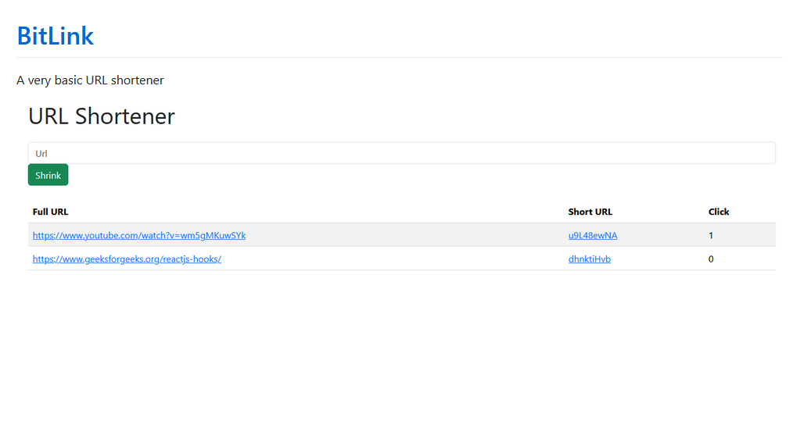

  <h2>A Very Basic URL Shortener</h2>
  
  
  
  
<em>(This project is using a local MongoDB instance)</em>

---

## Overview

This is a simple URL shortener built with Node.js, Express, and MongoDB. The application allows users to input a long URL and get a shortened version, which can be easily shared.

## Features

- Generate shortened URLs from long URLs